# Mini App người bệnh — Phòng khám phường Sài Gòn

Zalo Mini App cho **người bệnh**, là bề mặt thứ hai của hệ EMR ở
[`eHosp`](../../eHosp) — không phải một hệ thống lưu trữ riêng. Mọi dữ liệu đến
từ `emr-api` qua hợp đồng `/api/patient-app`.

React 18 · TypeScript · Vite 5 · `zmp-ui` · Jotai · Tailwind + SCSS.
Toàn bộ chữ hiển thị là **tiếng Việt**; định danh trong mã là tiếng Anh.

> **Cố ý không hiển thị nội dung lâm sàng.** Không chẩn đoán, không kết quả xét
> nghiệm, không tên thuốc, không liều dùng. Sổ sức khoẻ điện tử trên VNeID đã
> làm việc đó và có giá trị pháp lý tương đương bản giấy (QĐ 31/QĐ-BYT,
> 06/01/2026). Ranh giới này được canh bằng test:
> `src/services/__tests__/no-clinical-content.test.ts`.

---

## Màn hình

Ảnh chụp từ bản chạy thật ở chế độ dữ liệu giả (`VITE_USE_FAKE=true`).

### Liên kết tài khoản

Người bệnh không có tài khoản trong hệ thống. Liên kết đi bằng số điện thoại
Zalo **cộng một yếu tố thứ hai** — vì số trong hồ sơ có thể là của người nhà.

| Chưa liên kết | Bắt đầu liên kết | Xác minh ngày sinh |
| :---: | :---: | :---: |
| 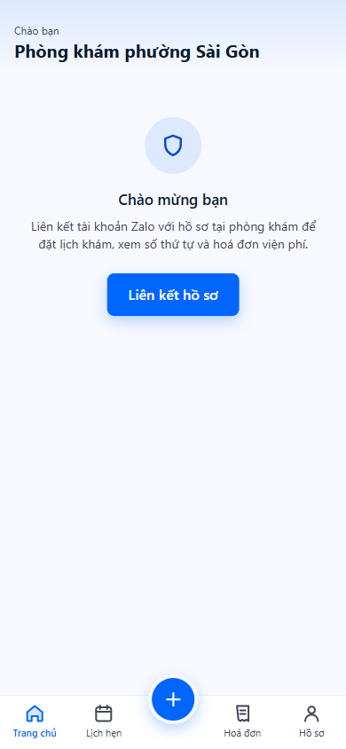 | 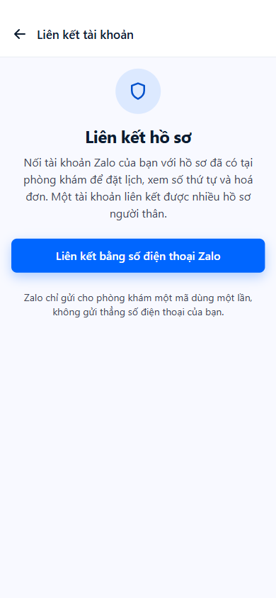 | 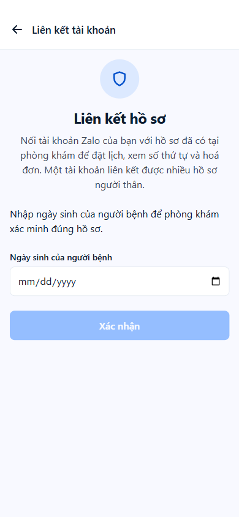 |

Zalo chỉ trả về một **mã dùng một lần**, không trả số điện thoại. Máy chủ đổi mã
đó ra số thật bằng secret key — secret key không bao giờ nằm trong mini app.

### Trang chủ

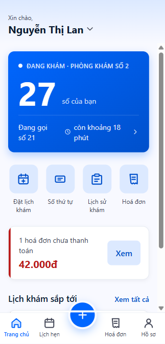

Thẻ trạng thái đầu trang là **số thứ tự hôm nay** — số của bạn, số đang gọi, và
ước tính thời gian chờ. Số thứ tự không có tab riêng.

### Đặt lịch khám

Ba bước: chuyên khoa → ngày và buổi → xác nhận. Không chọn bác sĩ cụ thể —
phòng khám phân công bác sĩ trực của buổi đã chọn.

| 1. Chuyên khoa | 2. Ngày và buổi | 3. Xác nhận |
| :---: | :---: | :---: |
| 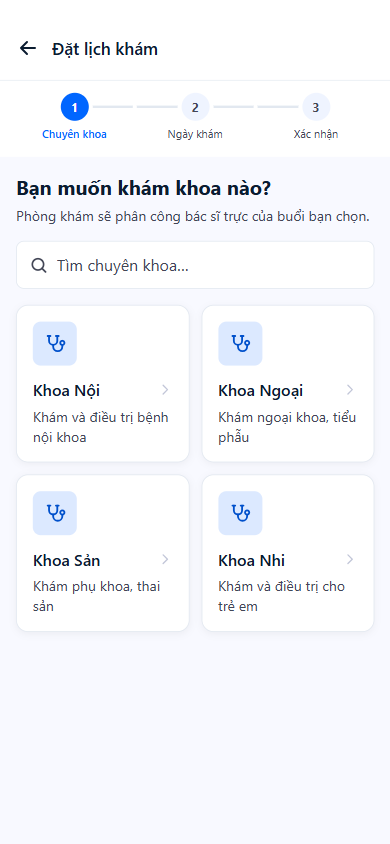 | 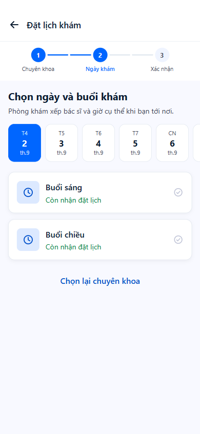 | 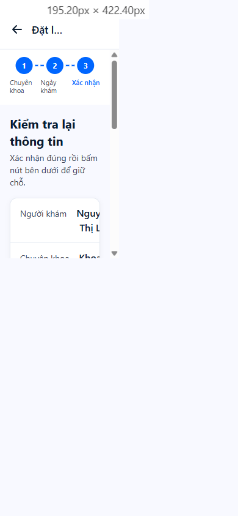 |

### Lịch hẹn và số thứ tự

| Lịch hẹn của tôi | Chi tiết lịch hẹn | Số thứ tự |
| :---: | :---: | :---: |
| 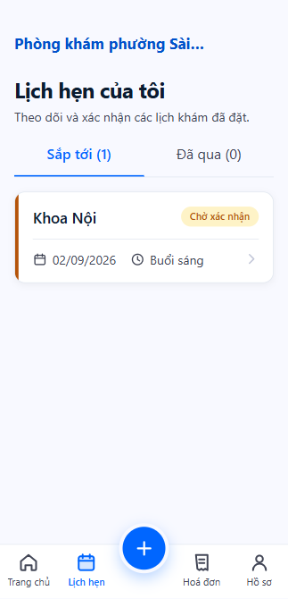 | 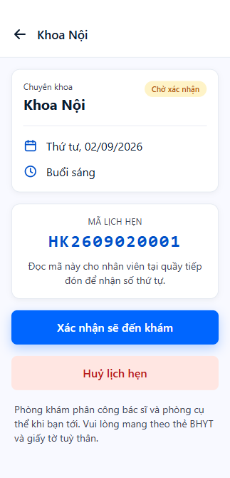 | 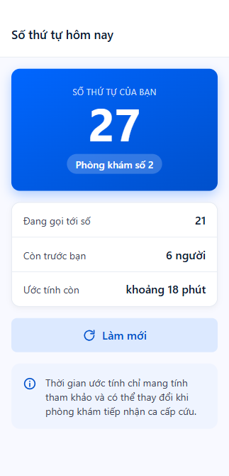 |

Mã lịch hẹn hiển thị để đọc cho quầy tiếp đón, nhưng **không bao giờ nằm trong
URL**: `buildUrl()` ném lỗi nếu ai đó đưa `code`/`token` vào query string, và có
test canh chừng (spec §6.2).

### Lịch sử khám, hoá đơn, hồ sơ

| Lịch sử khám | Hoá đơn | Mã VietQR | Hồ sơ |
| :---: | :---: | :---: | :---: |
| 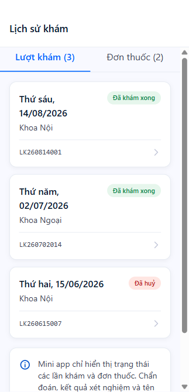 | 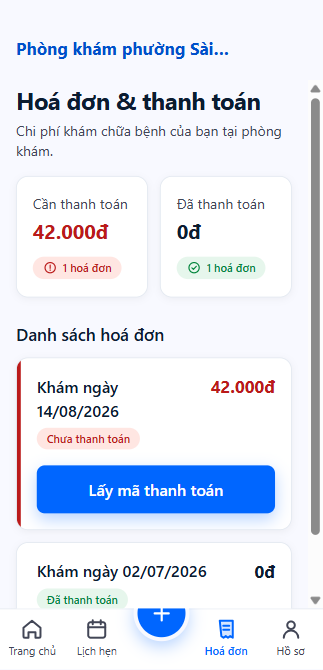 | 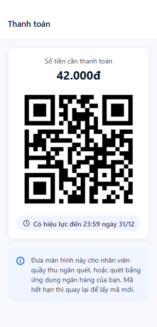 | 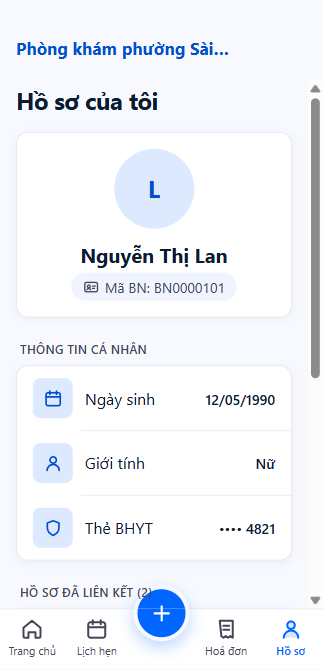 |

**Lịch sử khám** cố ý không mang tên "Bệnh án": nó chỉ hiện *ngày, khoa, mã lượt
khám, trạng thái* và *mã đơn, ngày kê, trạng thái phát thuốc* — không hơn.

Một tài khoản Zalo liên kết được **nhiều hồ sơ** (bố mẹ đặt lịch cho con), và
huỷ liên kết được rồi liên kết lại được.

---

## Phạm vi giai đoạn 1

**Trong phạm vi:** liên kết tài khoản · đặt lịch khám · lịch hẹn của tôi · số
thứ tự · lịch sử khám (chỉ siêu dữ liệu) · hoá đơn và mã VietQR.

**Ngoài phạm vi, cố ý:** nội dung lâm sàng · chọn bác sĩ cụ thể · khám từ xa ·
phát hành lên App Store / Google Play. Thông báo "kết quả đã có", đường web dự
phòng và ZNS nhắc hẹn thuộc **giai đoạn 2**.

---

## Chạy trên máy

```bash
npm install
npm start            # zmp start -P 3002 -> khung Zalo :3002, app thật :3001
npm test             # vitest run
npm run typecheck    # tsc --noEmit
```

Mở **`http://localhost:3002`**.

> `zmp start -P N` chiếm **hai** cổng: N phục vụ khung điện thoại Zalo, N−1 phục
> vụ app thật (khung nhúng iframe trỏ tới `port - 1`). Cả hai phải tránh 3000 —
> cổng của `emr-api` — nên dự án dùng 3002.

### Hai chế độ dữ liệu

| `.env` | Nguồn dữ liệu |
|---|---|
| `VITE_USE_FAKE=true` | Tầng dữ liệu giả trong `src/services/fake/`. Không chạm mạng, không cần máy chủ. Ngày sinh để liên kết thử: **`1990-05-12`** |
| `VITE_USE_FAKE=false` + `VITE_API_BASE_URL` | `emr-api` thật |

Chỉ có hai chế độ; không trộn lẫn. Đổi chế độ **không cần sửa dòng mã nào**.

Trỏ `VITE_API_BASE_URL` vào `127.0.0.1`, đừng dùng `localhost`: `zmp` bind `::1`
còn Docker bind `127.0.0.1`, nên `localhost` phân giải sang IPv6 trước và lời gọi
API đi ngược vào chính dev server.

### Cần gì cho máy chủ thật

- `emr-api` chạy, và `CORS_ORIGINS` trong `eHosp/.env` có origin của app —
  `http://localhost:3001` khi phát triển, `https://h5.zdn.vn` là origin webview
  Zalo. Để trống nghĩa là **không nạp middleware CORS chút nào**, và mọi lời gọi
  chết ở bước preflight vì client gửi header `X-Patient-Session`.
- `ZALO_APP_ID` và `ZALO_APP_SECRET` trong `eHosp/.env` để đổi mã
  `getPhoneNumber()` ra số điện thoại. Thiếu chúng ở `NODE_ENV=production` thì
  `/link` trả 503.

---

## Kiến trúc

**Entry:** `index.html` → `src/app.ts` → `src/router.tsx`.
Vite `root` là `./src`, nên `index.html` và `app-config.json` nằm trên một cấp.

| Tầng | Vai trò |
|---|---|
| `src/services/` | Tầng **duy nhất** chạm mạng. `http.ts` + `patient-app-api.ts` (hợp đồng §6) + `fake/` |
| `src/state.ts` | Ranh giới duy nhất giữa UI và dữ liệu. Trang chỉ đọc atom Jotai |
| `src/pages/` | Mỗi trang một thư mục, xuất component `*Page` |
| `src/components/ui/` | Bộ UI dùng chung: `Card`, `StatusChip`, `ListRow`, `EmptyState`… |

Mọi atom đọc dữ liệu người bệnh là `atomFamily` khoá theo `patientId` — chuyển
hồ sơ người thân không được lẫn dữ liệu.

`npm test` và `npm run typecheck` là hai cổng kiểm tra; chạy cả hai trước mỗi
commit. Test phủ `src/services`; các trang kiểm bằng cách chạy thật.

**`npx vite build` trần không chạy được** — `index.html` ở thư mục gốc trong khi
Vite `root` là `./src`. Build đi qua `zmp deploy`. `www/` là kết quả build,
không bao giờ sửa tay.

---

## Phát hành

1. `npm run login` — cần một lần, sinh `ZMP_TOKEN`.
2. Đặt `VITE_API_BASE_URL` trỏ tới tên miền HTTPS thật. Giá trị này được **nhúng
   cứng vào bundle lúc build**, nên đổi địa chỉ là phải deploy lại.
3. Khai tên miền đó trong Mini App Center.
4. Kiểm `VITE_USE_FAKE=false` — phát hành với `true` là phát hành dữ liệu bệnh
   nhân bịa cho người dùng thật.
5. `npm run deploy`.

Webview Zalo **chặn HTTP**, nên back-end bắt buộc phải có HTTPS.

---

## Tài liệu

| Tài liệu | Ở đâu |
|---|---|
| Thiết kế GĐ1 | `docs/superpowers/specs/2026-08-22-zalo-mini-app-gd1-design.md` |
| Kế hoạch triển khai | `docs/superpowers/plans/` |
| Thiết kế mô-đun gốc | `eHosp/docs/09-THIET-KE-DICH-VU/12-MOBILE-APP.md` |
| Hướng dẫn cho Claude Code | `CLAUDE.md` và `.claude/rules/` |
